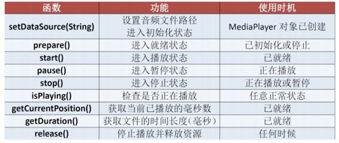
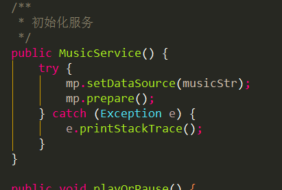
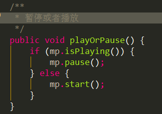
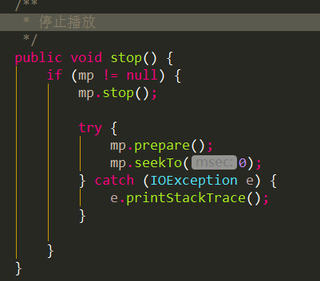
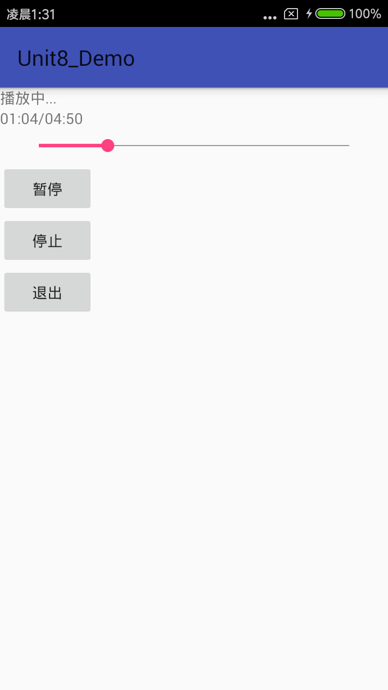
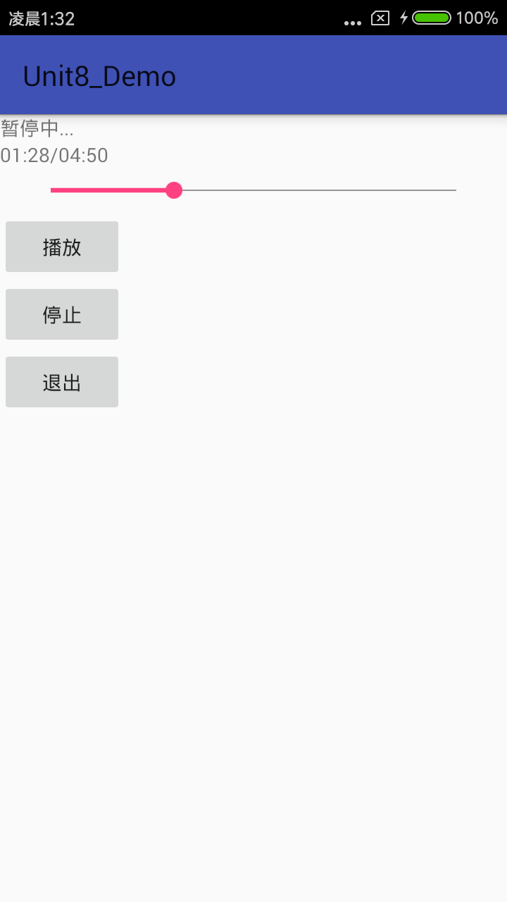
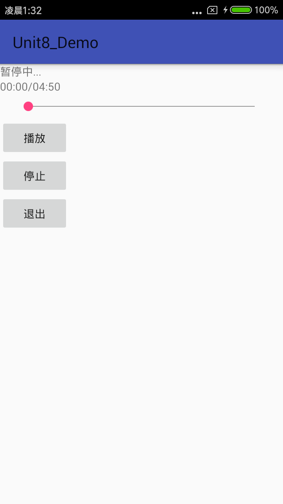

# Android实现简单音乐播放器(MediaPlayer)

#### 本节内容

 实现一个简单的音乐播放器，要求功能有：

* 播放、暂停功能；
* 进度条显示播放进度功能
* 拖动进度条改变进度功能；
* 后台播放功能；
* 停止功能；
* 退出功能；

1.  MediaPlayer 介绍

常用方法

2.  下载音乐文件

   随便下载一首歌曲保存在手机中.找到该歌曲的路径.

3. 使用 MediaPlayer

   创建对象初始化：

   

   播放/暂停：

  

  停止：

  

4. Service 的使用

创建 service 类，实现 MediaPlayer 的功能。 注意在 AndroidManifest.xml 文件里注册 Service：
通过 Binder 来保持 Activity 和 Service 的通信(写在 service 类)：

在 Activity 中调用 bindService 保持与 Service 的通信(写在 activity 类)： Activity 启动时绑定 Service：

bindService 成功后回调 onServiceConnected 函数，通过 IBinder 获取 Service 对 象，实现 Activity 与 Service 的绑定：

停止服务时，必须解除绑定，写入退出按钮中：

此时，在 Activity 的 onCreate 方法中执行上述与 Service 通信的方法后，即可实现 后台播放。点击退出按钮，程序会退出，音乐停止；返回桌面，音乐继续播放。

5. Handler的使用

Handler 与 UI 是同一线程，这里可以通过 Handler 更新 UI 上的组件状态，Handler 有很多方法，这里使用比较简便的 post 和 postDelayed 方法。

使用 Seekbar 显示播放进度，设置当前值与最大值：

定义 Handler：run 函数中进行更新 seekbar 的进度在类中定义简单日期格式，用来显 示播放的时间，用 time.format 来格式所需要的数据，用来监听进度条的滑动变化：

6. 效果图

 [参考文章1](http://blog.csdn.net/simplebam/article/details/64131770)

 [参考文章2](http://www.cnblogs.com/yanglh6-jyx/p/Android_Service_MediaPlayer.html)